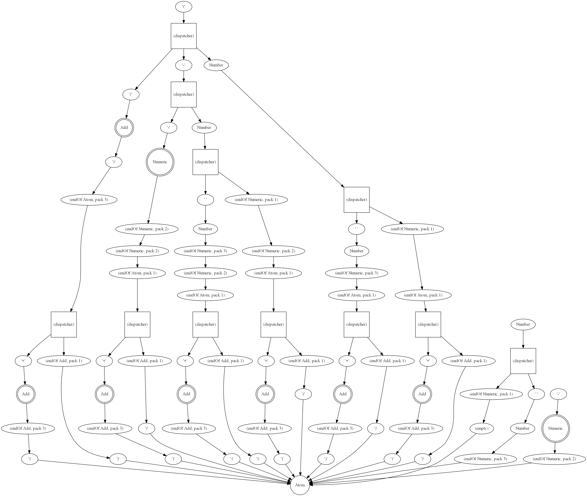

# rbnfrbnf-pretty

This is the visualization project for https://github.com/thautwarm/rbnfrbnf.

Given a grammar, you can plot corresponding graphs of the parser generated by rbnfrbnf with various backends.  

Attention: only the optimized bottom-up parser graph would be plotted, which is to say the nodes could be numerous as the consequence of grammar inline.

Here is an example(the codes for preparation could be found at https://github.com/thautwarm/rbnfrbnf/blob/master/hello_world.py):

```
Number  := R'\d+'
Numeric ::= Number | Number '.' Number | '-' Numeric
Add     ::= Atom ('+' Add) | Atom
Atom    ::= Numeric | '(' Add ')'
```

- Plot using graphviz
```python
from rbnfrbnf_pretty.graphviz.plot import plot_graph as plot_graphviz
from rbnfrbnf_pretty.d3.plot import plot_graph as plot_d3
plot_graphviz(get_connected_nodes(identified_nodes['Atom']), view=True)
```



- Plot using D3.js

```python
from rbnfrbnf_pretty.d3.plot import plot_graph as plot_d3
plot_d3(get_connected_nodes(identified_nodes['Atom']), view=True)
```

